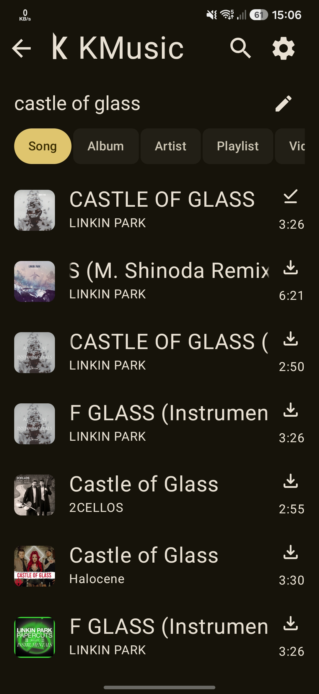
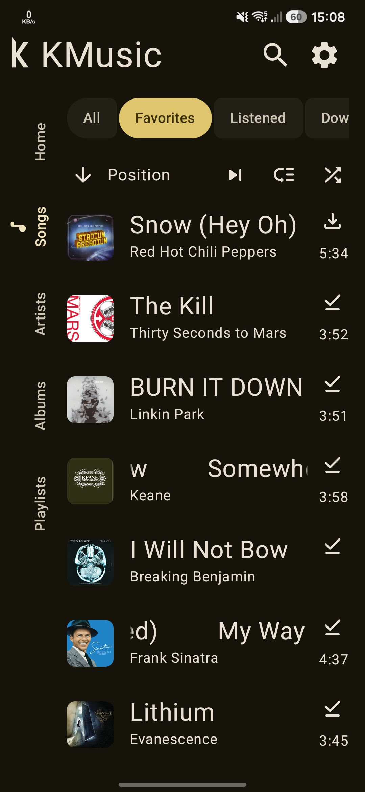
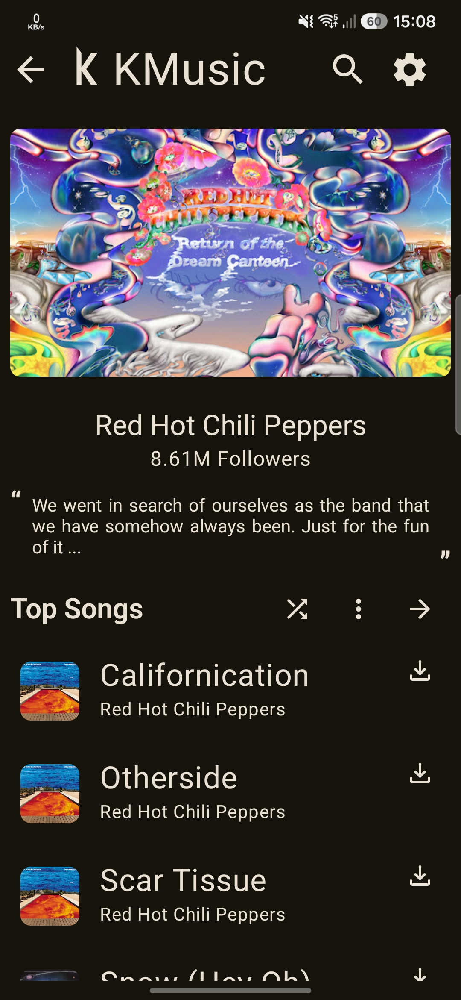
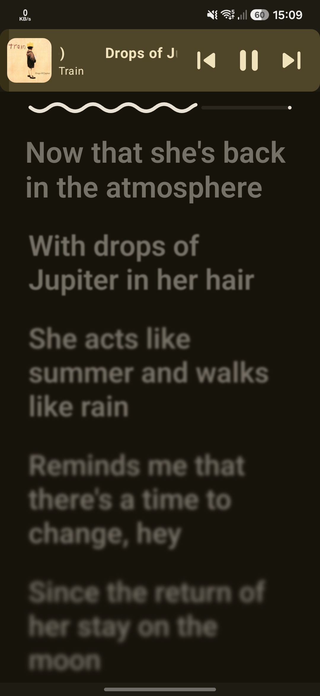
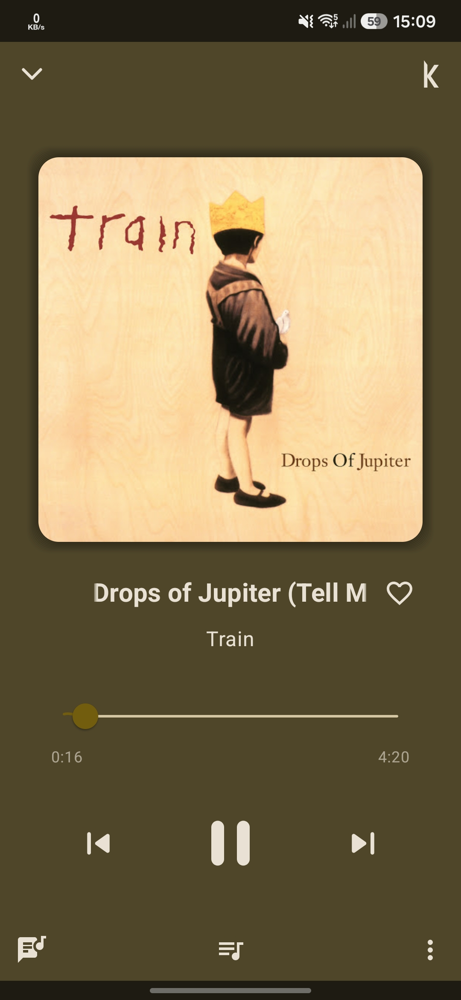
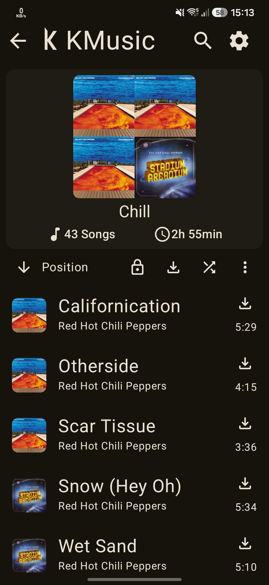

  

  
  
  

**KMusic** is an Android Music Player written in Kotlin that allows streaming music from YouTube Music.

---
## 📷 Screenshots

    
    
    
    
    
    

---
## ✨ Features
- In-app update checker
- Android Auto support
- Youtube music playlist import
- Synced lyrics from lrclib.net
- Song download
- Simple sleep timer
- Opening Youtube music links
- Search Youtube music for songs, albums, artists, playlists and videos

## 📲 Installation

## 🤝 Contributing
**Pull requests are welcome**
- If you want:
    - to **develop new functions** or **fix a bug**, fork the repository, send a pull request.

## 🫂 Acknowledgments
- [**ViMusic**](https://github.com/vfsfitvnm/ViMusic)
- [**RiMusic**](https://github.com/fast4x/RiMusic)
- [**YouTube-Internal-Clients**](https://github.com/zerodytrash/YouTube-Internal-Clients): A python script that discovers hidden YouTube API clients. Just a research project.
- [**waveformSeekBar**](https://github.com/massoudss/waveformSeekBar): Android Waveform SeekBar library
- [**HarmonyMusic**](https://github.com/anandnet/Harmony-Music): A cross platform App for streaming Music
- [**OuterTune**](https://github.com/OuterTune/OuterTune): A Material 3 Music Player for Android with local file & YouTube Music support.
- [**Seal**](https://github.com/JunkFood02/Seal): 🦭 Video/Audio Downloader for Android, based on yt-dlp (took heavy inspiration from their in-app updater)

## ❗ Disclaimer
This project, its contents are not affiliated with, funded, authorized, endorsed by, or in any way associated with YouTube, Google LLC or any of its affiliates, subsidiaries.

Any trademark, service mark, trade name, or other intellectual property rights used in this project are owned by the respective owners.
